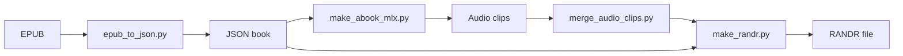

# RunAndRead-Audiobook

<div align="center">

</div>

---

## Overview

**RunAndRead-Audiobook** is an open-source pipeline for creating high-quality audiobooks using **open-source AI models**. It leverages **MLX-AUDIO** and **make_abook_mlx.py** to generate **RANDR format audiobooks**, which can be played in the **Run & Read** app for Android and iOS.

**Ensure your app version supports RANDR format:**
- **Android**: Version **1.5 (6)** or later.
- **iOS**: Version **1.6 (18)** or later.

**Apps**  
**App Store**: [Run & Read for Apple Devices](https://apps.apple.com/us/app/run-read-listen-on-the-go/id6741396289)  
**Google Play**: [Run & Read for Android](https://play.google.com/store/apps/details?id=com.answersolutions.runandread)

**QR codes**

<div align="center">
 &nbsp;&nbsp;&nbsp; 
</div>

---

## Features

- Convert **EPUB** to **JSON** for structured text extraction.
- Manually verify extracted text to remove unwanted sections.
- Generate TTS audio using **MLX-AUDIO (Kokoro-82M TTS model)**.
- Merge audio clips into a single audiobook file.
- Package audio and JSON into **RANDR format** for playback.
- Compatible with **Run & Read** apps on **iOS** and **Android**.
- Optimized for **Apple Silicon (M-series processors)**.

---

## Dependencies

- **Python 3.9+**
- **[MLX-AUDIO](https://github.com/Blaizzy/mlx-audio)** (TTS framework optimized for macOS/Apple M-series chips)
- **ffmpeg** (for audio processing)
- **EbookLib** (EPUB parsing)

---

## Installation

### **1) Set Up MLX-AUDIO**
```bash
pip install -e ~/projects/voice/mlx-audio
```

Ensure `espeak-ng` is installed to prevent Kokoro-82M from skipping words:
```bash
echo 'export ESPEAK_DATA_PATH=/opt/homebrew/share/espeak-ng-data' >> ~/.zshrc
source ~/.zshrc
```

### **2) Set Up ffmpeg**

- **macOS**: `brew install ffmpeg`
- **Ubuntu**: `sudo apt install ffmpeg`
- **Windows**: [Download from ffmpeg.org](https://ffmpeg.org/download.html) and add to system PATH.

---

## Pipeline Workflow

### **Step 1: Convert EPUB to JSON**
```bash
python epub_to_json.py epub/book.epub library/book.json 0
```
Manually inspect the output and rerun with adjusted parameters if necessary.
Check the terminal output to find how many lines should be skipped, then rerun the script with the number of the first
line to keep:

```bash
python epub_to_json.py epub/pg11.epub library/pg11.json 10
```

This ensures that the book starts from the correct position, e.g.:

> **10: CHAPTER I. Down the Rabbit-Hole**

### **Step 2: Generate TTS Audio using MLX-AUDIO**
```bash
python make_abook_mlx.py library/book.json
```

### **Step 3: Merge Audio Clips**
```bash
python merge_audio_clips.py library/book.json audio/book mp3
```

### **Step 4: Package as RANDR Format**
```bash
python make_randr.py audio/book/
```

📌 **Transfer the `.randr` file to your mobile device and open it in the Run & Read app!**

---

## Pipeline Schema



## Project Structure

```
runandread-audiobook/
├── epub_to_json.py      # Extracts text from EPUB into JSON
├── make_abook_mlx.py    # Generates audio using MLX-AUDIO
├── merge_audio_clips.py # Merges TTS-generated clips
├── make_randr.py        # Packages audio & JSON into RANDR format
├── assets/              # Icons, QR codes, and app store assets
├── epub/                # EPUB source files
├── audio/               # Generated audio files
├── library/             # JSON book structure
├── audiobooks/          # RANDR audiobooks samples
     ├── pg2680.randr    # Meditations by Emperor of Rome Marcus Aurelius
     ├── pg20203.randr   # Autobiography of Benjamin Franklin
├── README.md            # Documentation
└── requirements.txt     # Dependencies
```

---

## Contributions

We welcome contributions! Open an **issue** or submit a **pull request**.

---

## References

- **[MLX-AUDIO](https://github.com/Blaizzy/mlx-audio)** - TTS & STS library optimized for Apple M-series.
- **[Kokoro-TTS](https://huggingface.co/spaces/hexgrad/Kokoro-TTS)** - Open-weight TTS model.
- **[EbookLib](https://pypi.org/project/EbookLib/)** - EPUB parsing.
- **[Project Gutenberg](https://www.gutenberg.org)** - Free eBooks.

---

## Contact

- **[Sergey N](https://www.linkedin.com/in/sergey-neskoromny/)**

---

## License

This project is open-source under the **MIT License**.
