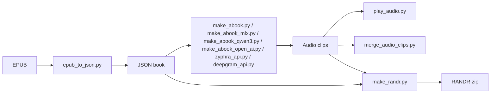

# RunAndRead-Audiobook-Pipeline

[](https://opensource.org/licenses/MIT)
[](https://www.python.org/downloads/)
[](https://github.com/sergenes/runandread-audiobook)
[](https://github.com/ml-explore/mlx)
[](https://github.com/Zyphra/Zonos)

**Related Projects:** [Run&Read Studio](https://github.com/sergenes/runandread-studio) |  [[RunAndRead-iOS]](https://github.com/answersolutionsapps/runandread-ios) | [[RunAndRead-Android]](https://github.com/answersolutionsapps/runandread-android)

**Docs:** [RANDR.md](RANDR.md) (step-by-step pipeline guide) | [qwen3_tts/README.md](qwen3_tts/README.md) (Qwen3-TTS engine) | [CHANGELOG.md](CHANGELOG.md)


<div align="center">

</div>

---

## Overview

RunAndRead-Audiobook is an open-source project aimed at generating high-quality text-to-speech (TTS) audiobooks using
open-source models like **Zyphra/Zonos**.

The ultimate goal is to make **Run & Read**, the audiobook player app, sound more natural by using high-quality voices.
Currently, it relies on the standard voices embedded in **Apple** and **Android** devices, which are still not perfect.
Starting from Android v1.5 (6) and iOS v1.6 (18), Run & Read supports MP3 audiobooks generated using the RANDR pipeline in this repository. [See instructions here](https://github.com/sergenes/runandread-audiobook/blob/main/RANDR.md).

**Apps**

**App Store**: [Run & Read for Apple Devices](https://apps.apple.com/us/app/run-read-listen-on-the-go/id6741396289)  
**Google Play**: [Run & Read for Android](https://play.google.com/store/apps/details?id=com.answersolutions.runandread)

**QR codes**

<div align="center">
 &nbsp;&nbsp;&nbsp; 
</div>
---

## Create Audiobooks with AI (RANDR format)

Generate **high-quality audiobooks** at home using open-source AI models! We’ve built a **pipeline** using **MLX-AUDIO** to create audiobooks in the **RANDR format**, optimized for playback in the **Run & Read** app.

**[Dedicated document with step-by-step instructions](https://github.com/sergenes/runandread-audiobook/blob/main/RANDR.md)**

## Features
- Pipeline for generating audiobooks compatible with the Run & Read app.
- Convert EPUB to JSON for text extraction.
- Generate audio using **Zonos TTS**, **Kokoro-TTS**, or **Qwen3-TTS** (AUDIO-MLX).
- Qwen3-TTS runs fully self-contained and local on Apple Silicon, with a choice of 9 preset voices across 10 languages. [See qwen3_tts/README.md](qwen3_tts/README.md).
- Clone voices from an MP3 sample.
- Play audio clips sequentially while displaying text in the terminal.
- Merge audio clips into one file.
- Zyphra and Deepgram API support for cloud-based TTS.
- Wrap produced audio and JSON files into a ZIP readable by the Run & Read app.
- Transfer audio files to a mobile phone and play them in the Run & Read app.

**Planned**
- Estimate local vs. cloud generation cost.
- On-device TTS for Android/iOS.

---

## Audio Samples

Here are some audiobook samples generated using RunAndRead-Audiobook with **Zonos TTS voice cloning**:

[[Sample 1 - *Alice in Wonderland*]](https://www.youtube.com/shorts/cy8pdPn7gNk)

You can find examples under the **audio/pg11/** folder, and generate your own samples using the steps outlined in the **Usage** section below.

---

## Dependencies & Technologies

- **Python 3.9+**
- **[Zyphra/Zonos](https://github.com/Zyphra/Zonos)** (open-source TTS engine)
- **ffmpeg** (audio conversion)
- **[EbookLib](https://pypi.org/project/EbookLib/)** (EPUB parsing)
- **PyAudio** / `playsound` (for playback)
- **yt-dlp** (to download MP3 files from YouTube for voice cloning)

---

## Installation

### **1) Install Python Dependencies**

```bash
pip install -r requirements.txt
```

### **2) Set Up Zyphra/Zonos**

Follow the official installation instructions from [Zyphra/Zonos](https://github.com/Zyphra/Zonos). Using a `uv` virtual
environment is recommended for running RunAndRead scripts. After installing the Zonos project, run the `sample.py`
script:

```bash
uv run sample.py
```

This will download the **"Zyphra/Zonos-v0.1-transformer"** base model from Hugging Face and store it in your
environment.

### **3) Set Up ffmpeg**

- **macOS**: `brew install ffmpeg`
- **Ubuntu**: `sudo apt install ffmpeg`
- **Windows**: [Download from ffmpeg.org](https://ffmpeg.org/download.html) and add to system PATH.

### **4) Download a Voice Sample from YouTube**

To train a **Zonos voice clone**, you'll need an MP3 sample of the speaker. A **10-20 minute video** with a single
speaker (e.g., a tutorial or audiobook) is recommended. You can download an MP3 track from YouTube using `yt-dlp`:

```bash
yt-dlp -x --audio-format mp3 "https://www.youtube.com/watch?v=MkLBNUMc26Y" -o "assets/exampleaudio.mp3"
```

This `exampleaudio.mp3` file will be used by the Zonos model to fine-tune the voice sample before actual synthesis.

---

## Usage

### **Step 1: Convert EPUB to JSON**

First, run this script with `0` as the third parameter:

```bash
python epub_to_json.py epub/pg11.epub library/pg11.json 0
```

Check the terminal output to find how many lines should be skipped, then rerun the script with the number of the first
line to keep:

```bash
python epub_to_json.py epub/pg11.epub library/pg11.json 10
```

This ensures that the book starts from the correct position, e.g.:

> **10: CHAPTER I. Down the Rabbit-Hole**

**Note**: Without an NVIDIA GPU, converting an entire book to audio takes a long time. A **30-second** audio clip
takes approximately **3 minutes** to generate on macbook pro, m1. A full book can take **dozens of hours**. For example,
*Alice’s Adventures in Wonderland* is **3 hours long**, meaning **18 hours of processing** on a MacBook Pro with an M1
processor. **However, the `make_abook` script can be interrupted at any time, and it will resume from the position where
it was stopped.**

### **Step 2: Generate TTS Audio Files**

```bash
uv run python make_abook.py library/pg21279.json assets/kurt_v.mp3
```

### **Step 3: Play Audiobook in CLI**

```bash
python play_audio.py audio/pg11 mp3
```

### **Step 4: Merge a set of audio clips into one audio file**

```bash
python merge_audio_clips.py library/pg11.json audio/pg11 mp3
```

### **Step 5: Prepare audio clip for YouTube/LinkedIn**

```bash
# YouTube
ffmpeg -loop 1 -i assets/ic_launcher.png -i audio/pg11/merged_output.mp3 -c:v libx264 -c:a aac -b:a 192k -shortest output.mp4 
```

```bash
# LinkedIn
ffmpeg -loop 1 -i appGoogle.png -i merged_output.mp3 -vf "scale=1080:1080,format=yuv420p" -c:v libx264 -tune stillimage -c:a aac -b:a 192k -shortest output.mp4

# X
ffmpeg -loop 1 -i appGoogle.png -i merged_output.mp3 -vf "scale=1080:1080,format=yuv420p" -c:v libx264 -tune stillimage -c:a aac -b:a 192k -pix_fmt yuv420p -shortest output.mp4

```

### **Step 6: Set up REST Zyphra/Deepgram/OpenAI SDK**

```bash
# Zyphra
export ZYPHRA_API_KEY="your-zyphra-api-key"
python zyphra_api.py library/pg11.json
```

```bash
# Deepgram
export DEEPGRAM_API_KEY="your-deepgram-api-key"
python deepgram_api.py library/pg11.json
```

```bash
# OpenAI MINI TTS
export OPENAI_API_KEY="your-open-api-key"
python make_abook_open_ai.py library/pg11.json
```

### **Step 7: Set up MLX-AUDIO (cloned local repo)**

```bash
pip install -e ~/projects/voice/mlx-audio
```
---
**Note**: Kokoro-82M TTS model skips names and other out-of-dictionary (OOD) words due to its reliance on an external grapheme-to-phoneme (g2p) conversion tool called espeak-ng2. This behavior occurs when espeak-ng is not properly installed or detected by the system.
To prevent Kokoro-82M from skipping names and OOD words, you need to install `espeak-ng`

```bash
echo 'export ESPEAK_DATA_PATH=/opt/homebrew/share/espeak-ng-data' >> ~/.zshrc
source ~/.zshrc

# make audio book
python make_abook_mlx.py library/pg2680.json 
```

### **Step 8: Set up Qwen3-TTS (self-contained, Apple Silicon only)**

Unlike the other engines, Qwen3-TTS is fully self-contained in its own `qwen3_tts/` folder with its own dependencies — no local clone paths, no API keys, nothing outside this repo. See **[Qwen3-TTS Support](#qwen3-tts-support)** below for the full walkthrough.

```bash
cd qwen3_tts
pip install -r requirements.txt
cd ..

# make audio book
python make_abook_qwen3.py library/pg2680.json --voice Ryan --language English
```

### **Step 9: Make RANDR Audiobook**
```bash
python make_randr.py audio/pg20203/
```

## Pipeline Schema



## Project Structure

```
runandread-audiobook/
├── epub_to_json.py      # Extracts text from EPUB into JSON
├── make_abook.py        # Converts text into audio files with Zonos TTS
├── make_abook_mlx.py    # Converts text into audio files using the Kokoro-82M TTS model with mlx-audio (optimized for Apple M-series processors).
├── make_abook_qwen3.py  # Converts text into audio files using Qwen3-TTS (self-contained, see qwen3_tts/) - optimized for Apple M-series processors.
├── make_randr.py        # Wrap the produced audio and JSON files into a ZIP file readable by the Run & Read app.
├── play_audio.py        # Play audio clips sequentially while displaying text
├── merge_audio_clips.py # Merges audio files into one and generates a timestamped JSON file
├── word_tokens_tools.py # Utility to normalize the text before pass it to the TTS
├── test_scan_next.py    # Unit tests to make sure text normalization works as expected
├── zyphra_api.py        # Converts text into audio files with Zyphra SDK/Rest API API
├── deepgram_api.py      # Converts text into audio files with Deepgram SDK/Rest API API
├── make_abook_open_ai.py# Converts text into audio files with OpenAI TTS
├── qwen3_tts/            # Self-contained Qwen3-TTS engine (own README + requirements.txt, no external project dependency)
│   ├── converter.py      # Qwen3TTSConverter - model loading, voice/language selection, generation
│   ├── cli.py             # Standalone CLI to generate a single test clip
│   ├── requirements.txt  # mlx-audio, mlx, numpy
│   └── README.md         # Dedicated documentation
├── assets/              # Stores MP3 files for voice cloning
├── epub/                # EPUB books from the Gutenberg Project
├── audio/               # Output audio files
├── audiobooks/          # RANDR audiobooks samples
     ├── pg2680.randr    # Meditations by Emperor of Rome Marcus Aurelius
     ├── pg20203.randr   # Autobiography of Benjamin Franklin
├── library/             # Output JSON book files
├── README.md            # Documentation
├── requirements.txt     # Dependencies
└── LICENSE              # Open-source license
```

---

## Qwen3-TTS Support

[**Qwen3-TTS**](https://github.com/QwenLM/Qwen3-TTS) runs entirely **locally and in-process on Apple Silicon** via [mlx-audio](https://github.com/Blaizzy/mlx-audio) — no server, no API key, no cloud calls. It's fully self-contained in the [`qwen3_tts/`](qwen3_tts/) folder: its own dependencies, its own README, and no dependency on any other project. The only thing that gets downloaded is the model itself, once, on first use.

It supports **9 preset voices across 10 languages** (configurable per run), unlike the single hardcoded voice/language the other local engines use today.

### How to add support

Requires an Apple Silicon Mac (M1/M2/M3/M4) — MLX does not run on Intel/Windows/Linux.

```bash
cd qwen3_tts
pip install -r requirements.txt
cd ..
```

That's it. No extra environment, no local repo clone, no account. The model (a few GB) downloads automatically the first time you generate audio.

### How to use it

**1) Quick standalone test** (confirms your setup works before touching a real book):

```bash
python qwen3_tts/cli.py "Hello from Run and Read." --voice Ryan --language English --out test.mp3
```

List all available voices/languages/models:

```bash
python qwen3_tts/cli.py --list-voices
```

**2) Generate a full audiobook**, same shape as the other engines — convert your EPUB to JSON first (see Step 1 above), then:

```bash
# Generate TTS clips (resumable - safe to interrupt and rerun)
python make_abook_qwen3.py library/pg11.json --voice Ryan --language English

# Merge clips into one file + timestamped JSON
python merge_audio_clips.py library/pg11.json audio/pg11 mp3

# Package as a .randr file for the Run & Read app
python make_randr.py audio/pg11/
```

**3) Try a different voice or language** — e.g. a Chinese narration with the `Vivian` voice, using the smaller/faster 0.6B model:

```bash
python make_abook_qwen3.py library/my_chinese_book.json --voice Vivian --language Chinese --model 0.6b
```

**4) Tune narration style and long-run stability**:

```bash
python make_abook_qwen3.py library/pg11.json \
  --instruct-preset steady \
  --reload-every 10
```

`--instruct-preset` picks a named style (`dramatic` default, or `steady` for calmer pacing) - see [Instruct presets](qwen3_tts/README.md#instruct-presets). `--reload-every` periodically reloads the model during long book conversions, which fixes a real decode-stability issue observed on multi-hour runs (see [Troubleshooting](qwen3_tts/README.md#troubleshooting)); it's already the default, exposed here in case you want to tune it.

> **Environment check**: if you're reusing a conda/venv environment that also ran the Kokoro (`make_abook_mlx.py`) setup, make sure it has the real `mlx-audio` package, not an old editable clone (`pip install -e ~/projects/voice/mlx-audio`, per the Step 7 setup above) - run `pip show mlx-audio` in that exact environment and confirm there's no `Editable project location` line and the version is current. An old editable install was the root cause of a real "few words then silence" failure - see [qwen3_tts/README.md Troubleshooting](qwen3_tts/README.md#troubleshooting) for the fix.

### Voices & Languages

| Voice      | Native language | | Voice      | Native language |
|------------|-----------------|-|------------|-----------------|
| `Ryan`     | English         | | `Dylan`    | Chinese (Beijing dialect) |
| `Aiden`    | English         | | `Eric`     | Chinese (Sichuan dialect) |
| `Vivian`   | Chinese         | | `Ono_Anna` | Japanese |
| `Serena`   | Chinese         | | `Sohee`    | Korean |
| `Uncle_Fu` | Chinese         | | | |

Any voice can read any of the 10 supported languages: `Auto`, `Chinese`, `English`, `Japanese`, `Korean`, `German`, `French`, `Russian`, `Portuguese`, `Spanish`, `Italian`.

Full details, the Python API, and troubleshooting: **[qwen3_tts/README.md](qwen3_tts/README.md)**.

---

## Contributions

Contributions are welcome! Feel free to open an issue or submit a pull request.

---

## References & Kudos

- **[Zonos](https://github.com/Zyphra/Zonos)** - Open-source TTS model.
- **[AUDIO-MLX](https://github.com/Blaizzy/mlx-audio)** - A TTS and STS library built on Apple's MLX framework.
- **[Kokoro-TTS](https://huggingface.co/spaces/hexgrad/Kokoro-TTS)** - An open-weight TTS model with 82 million parameters.
- **[Qwen3-TTS](https://github.com/QwenLM/Qwen3-TTS)** - Open-source multilingual TTS model by the Qwen team at Alibaba Cloud, integrated self-contained in [`qwen3_tts/`](qwen3_tts/).
- **[Deepgram](https://deepgram.com/)** - Commercial cloud-based TTS.
- **[EbookLib](https://pypi.org/project/EbookLib/)** - EPUB parsing in Python.
- **[yt-dlp](https://github.com/yt-dlp/yt-dlp)** - YouTube audio downloader for voice cloning.
- **[Gutenberg Project](https://www.gutenberg.org)** - A library of over 75,000 free eBooks.
- **[Python Simplified, MariyaSha](https://www.youtube.com/@PythonSimplified)** - Python Simplified. Kudos to Mariya for
  her beautiful voice that I did clone from one of her videos.

---

## Contact

- **[Sergey N](https://www.linkedin.com/in/sergey-neskoromny/)** - Connect and follow me on LinkedIn.

---

## License

This project is open-source and available under the **MIT License**.
